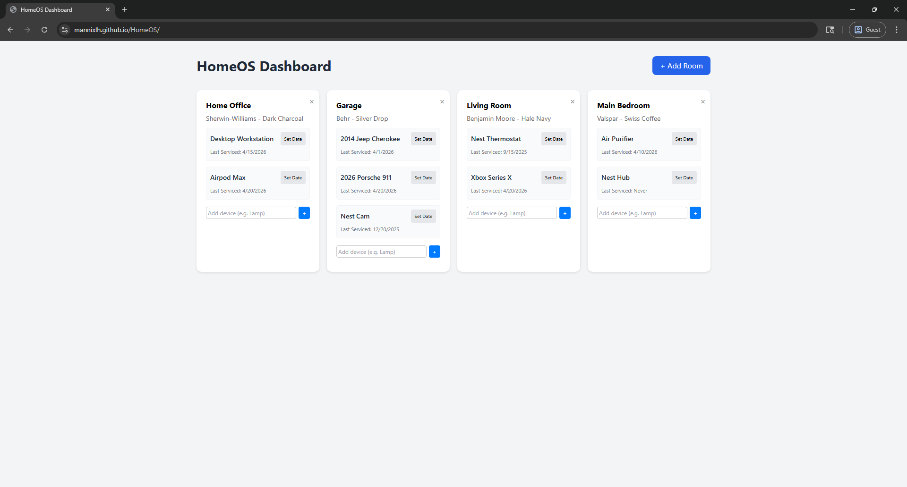
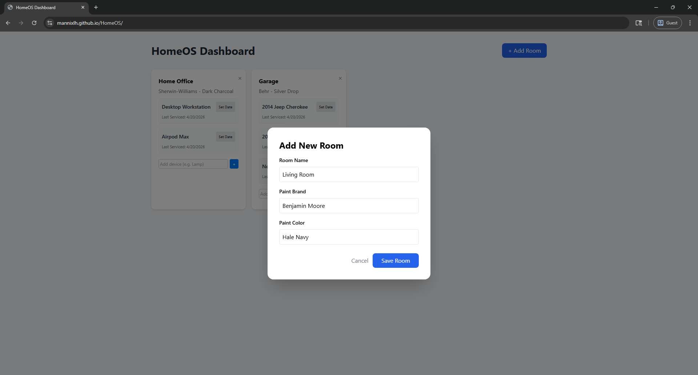
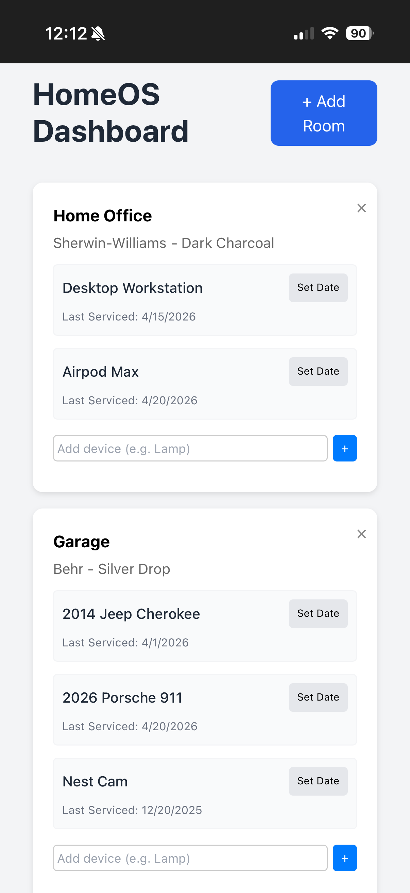

## HomeOS Dashboard
**Live Site:** [View HomeOS Prototype](https://mannixlh.github.io/HomeOS/)

**Demo Video:** [Link to video](https://www.youtube.com/watch?v=sc_zqfqkGLs)

***Please note:** 60-second wake-up time*

## Overview
**HomeOS** is a centralized management platform designed for homeowners to catalog and track room-specific maintenance data. This will help manage complex home data, from paint specifications used during renovations to the growing ecosystem of smart hardware, HomeOS provides a persistent "digital twin" of the physical living environment.

The primary purpose of this prototype is to bridge the gap between physical home maintenance and digital logging, ensuring that critical data is never lost during hardware failures or upgrades.

## Key Features
* **Room Management:** Create and delete rooms with metadata like paint brand and color names.
* **Maintenance Logging:** A one-click "Reset Date" feature to log when a device was last serviced.
* **Dynamic UI:** Built with React and Tailwind CSS for a responsive, modern experience.
* **Persistent Storage:** All data is securely stored in a cloud hosted MongoDB database.

## Technology Stack
* **Frontend:** React, Tailwind CSS, AXIOS
* **Backend:** Node.js, Express.js
* **Database:** MongoDb Atlas (Mongoose ODM)
* **Deployment:** Github Pages and Render

## Installation & Setup
1. **Clone the repository**
2. **Install dependencies:**
`npm install`
3. **Environment Variables:**
Create a `.env` file in the root and add your MongoDB connections string.
4. **Start the server:**
`node server.js`

## Roadmap
* [ ] **Automated Reminders:** Push notifications when a device exceeds 6 months without service.
* [ ] **Security:** User authentication and role-based access control.
* [ ] **IoT Integration:** Live API hooks for smart home integration.

## Screenshots

### **Main Dashboard**

*The centralized dashboard displaying all registered rooms, paint specifications, and device maintenance logs.*

### **Room Management**

*The interface for adding a new room with custom paint brands and colors to the MongoDB database.*

### **Mobile View**

*Responsive design ensuring homeowners can access their logs via mobile devices.*

## Contact
Mannix Holman
mlh6478@psu.edu
